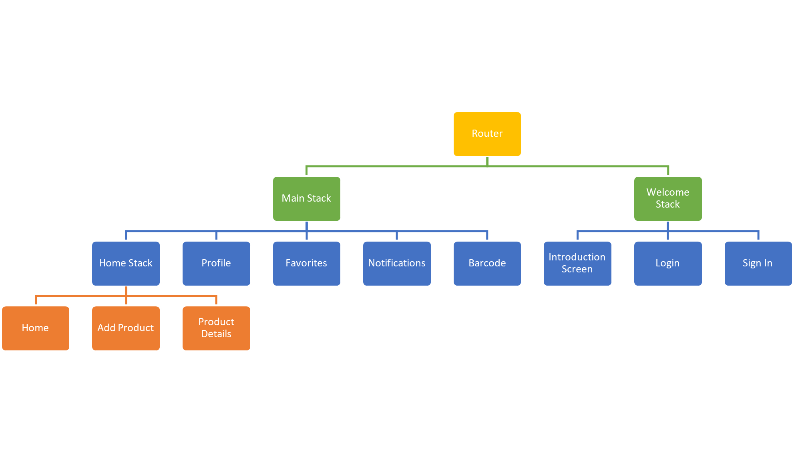
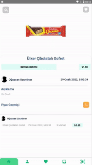

# pinti # React-Native

This project was carried out within the scope of the **Management Information Systems (MIS)** 4th grade midterm project. In this project, the price information of the products is presented.

# Used Technologies

Front-End : **React-Native** <br>
Cloud-Server : **Firebase**

# How to Install?

Follow React Documentation for Android: [Click](https://reactnative.dev/docs/environment-setup) <br>
Follow Firebase React-Native Documentation for Android: [Click](https://rnfirebase.io/) <br>

```
npm install
npx react-native start
npx react-native run-android
```

or

```
yarn install
npx react-native start
npx react-native run-android
```

## Used Packages

- React Native Firebase (App, Auth, Firestore, Storage)
- React Native Navigation
- React Native Push Notification
- React Native Currency Input
- React Native Image Picker
- React Native Onboarding Swiper
- React Native Scan Barcode
- React Native Vector Icons
- Formik
- Yup
- Moment
- Lottie
- Lodash.Filter

## Screens

<p align="center">
  
</p>

## Properties

- Membership System
- Add/remove profile photo
- Change password
- Introduction Screens
- Product CRUD processors
- Search operations by product name or barcode
- Filtering processes of the product
- Price record list of the product
- Add/remove from favorites

## Firestore Database Collections

- Users
- Products
- Favorites
- Price_History

## Storage Files

- image/productPic
- image/profilePic

## ScreenShot

---

### Sign Up - Add Product

  
  

### Favorite - Update - Notification

  

## Developers

---

[Oğuzcan Uzunöner](https://github.com/oguzcanuzunoner)
<br>

[Mehmet Erdem Akın](https://github.com/Mehmet-Erdem-Akin)

## Licence

---

[MIT](https://choosealicense.com/licenses/mit/)
